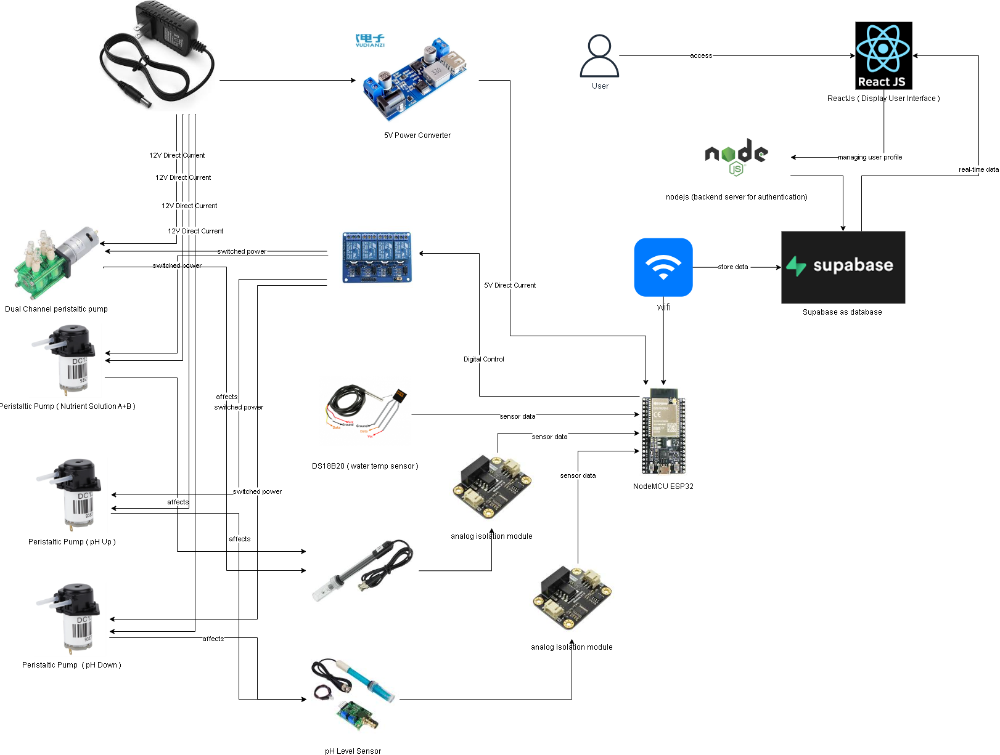

# 🌱 IoT-Enabled Web-Based Automated Hydroponic System

A full-stack IoT hydroponic solution for **real-time monitoring** and **automated control** of pH, EC, and water temperature, built using **ESP32**, **Supabase**, **ReactJS**, and **Telegram Bot API**. Designed for small to medium-scale hydroponic farms to improve resource efficiency, yield consistency, and ease of management.

---

## 🚀 Features

- **Real-time monitoring** of pH, EC, and water temperature (ESP32)
- **Automated pump dosing** based on plant profiles (pH/EC thresholds)
- **React dashboard** with charts (ApexCharts) and admin/user pages
- **Supabase backend** for realtime DB, auth, and storage
- **Telegram Bot** for alerts and live commands
- **Sensor calibration** with persistent EEPROM storage
- **Database triggers** for automation & alert deduplication

---

## 🧠 System Architecture

**High-level flow**:
1. ESP32 reads sensors every 10s → computes pH/EC/temp.  
2. ESP32 fetches `selected_plant_id` from `system_config`.  
3. ESP32 fetches thresholds from `plant_profiles` (or `multiplant_profiles`).  
4. If values out of range → trigger relevant pump(s) for **3s**.  
5. ESP32 inserts reading + pump status into `sensor_data`.  
6. Supabase triggers backend notifications → Telegram bot alerts users.

---

## 🔧 Hardware Requirements

| Component                  | Notes                                      |
|----------------------------|--------------------------------------------|
| ESP32 Dev Board            | Wi-Fi MCU                                  |
| DS18B20                    | Water temperature sensor                   |
| Analog pH sensor module    | pH measurement and calibration             |
| Analog EC sensor module    | Electrical Conductivity (EC)               |
| 4-channel Relay Module     | Switches pumps (active LOW typical)        |
| Peristaltic Pumps (×4)     | pH up / pH down / nutrient A / nutrient B  |
| Power supply               | For pumps and ESP32 (separate rails advised)|

---

## 🛠️ Software Stack

- **Firmware:** Arduino IDE (C++), libraries: WiFi, HTTPClient, ArduinoJson, ESPSupabase, DallasTemperature, DFRobot_ESP_PH, DFRobot_ESP_EC, EEPROM  
- **Backend:** Node.js + Express, supabase-js, webhook-based Telegram Bot  
- **Frontend:** ReactJS, TailwindCSS, ApexCharts  
- **DB:** Supabase (Postgres w/ RLS & Realtime)

---

## ⚙️ Setup (copy-paste friendly)

### 1) ESP32 Firmware
- Install Arduino IDE and libraries:
  ~~~bash
  # Install via Library Manager or add manually
  WiFi.h, HTTPClient.h, ArduinoJson, ESPSupabase,
  OneWire, DallasTemperature, DFRobot_ESP_PH, DFRobot_ESP_EC, EEPROM
  ~~~
- Edit firmware constants (Wi-Fi, Supabase URL/Key) **in your local .ino** (do NOT commit service keys to git).
- Compile & flash to ESP32.

### 2) Supabase
- Create tables (example):
  - `sensor_data` (water_temperature, ph, ec, pump1..pump4, plant_id, plant_name, created_at)
  - `plant_profiles` (id, name, ph_min, ph_max, ec_min, ec_max)
  - `multiplant_profiles` (id, name, ph_min, ph_max, ec_min, ec_max)
  - `system_config` (id, selected_plant_id, updated_at)
  - `profiles` (users)
- Enable Row Level Security (RLS) and create appropriate policies.
- Use database triggers for automation (e.g., alert dedup, timestamps).

### 3) Node.js Backend & Telegram Bot
- Install deps:
  ~~~bash
  npm install express node-telegram-bot-api supabase-js cors dotenv
  ~~~
- Create `.env` (example):
  ~~~env
  SUPABASE_URL=https://your-supabase-url.supabase.co
  SUPABASE_KEY=your_service_role_key   # KEEP SECRET: do NOT push to public repo
  TELEGRAM_TOKEN=your_telegram_bot_token
  FRONTEND_URL=https://your-frontend.example.com
  ~~~
- Deploy (DigitalOcean, Render, Heroku, etc.) and set your Telegram webhook to `https://<your-server>/webhook`.

### 4) React Frontend
- Install & run:
  ~~~bash
  npm install
  npm start
  ~~~
- Create `.env` in frontend:
  ~~~env
  REACT_APP_SUPABASE_URL=https://your-supabase-url.supabase.co
  REACT_APP_SUPABASE_ANON_KEY=your_anon_key
  ~~~
- Build & host the frontend.

---

## 📜 ESP32 Firmware Operation (concise)

1. Initialize Wi-Fi, sensors (DS18B20, pH, EC), EEPROM, and relay pins (all OFF).  
2. Every **10 seconds**: read temperature, pH voltage, EC voltage → compute compensated pH & EC.  
3. GET `selected_plant_id` from `system_config`.  
4. GET profile thresholds from `plant_profiles` or `multiplant_profiles`.  
5. If values outside thresholds → turn pump on (digitalWrite LOW for active LOW relays), delay 3s, then turn off. Track pump flags.  
6. POST JSON to `sensor_data` containing temperature, pH, EC, pump flags, plant_id, and plant_name.  
7. Run calibration routines when needed and persist calibration in EEPROM.

---

## 🤖 Pump Logic (3s pulses)

| Condition     | Pump        |
|---------------|-------------|
| EC < ec_min   | Pump 1      |
| EC > ec_max   | Pump 2      |
| pH < ph_min   | Pump 3      |
| pH > ph_max   | Pump 4      |

---

## ⚠️ Security & Best Practices

- **Never** commit service-role keys or Wi-Fi passwords to a public repo. Put them in `.env` and add `.env` to `.gitignore`.  
- Use Supabase **service_role** key only on backend (server-side). Frontend should only use `anon` key.  
- Protect API endpoints with CORS and validate inputs.

---

## 🔧 Troubleshooting

- If sensor readings unstable → re-calibrate pH/EC, check wiring and sensor warm-up times.  
- If pumps never trigger → verify relay logic (active LOW vs active HIGH).  
- If backend alerts duplicate → check alert dedup logic (lastSeenId / timestamp guard).

---

## Appendix — Short firmware excerpt

ESP32 firmware excerpt (safe placeholders)

~~~cpp
#include <WiFi.h>
#include <HTTPClient.h>
#include <ArduinoJson.h>
#include <ESPSupabase.h>
#include <OneWire.h>
#include <DallasTemperature.h>
#include "DFRobot_ESP_PH.h"
#include "DFRobot_ESP_EC.h"
#include <EEPROM.h>

const char* ssid = "YOUR_WIFI_SSID";
const char* password = "YOUR_WIFI_PASSWORD";
const char* supabaseUrl = "https://YOUR_SUPABASE_URL.supabase.co";
const char* supabaseKey = "YOUR_SERVICE_ROLE_KEY"; // DO NOT push to public repo

// pin and sensor setup...
// main loop: read sensors, fetch profile, run pump logic, insert to supabase
~~~

---

## License
MIT — see `LICENSE` file.

---

**How to paste:** copy everything from the top of this block (`# 🌱`) down to the `MIT` line, create/update `README.md` in your repo, paste, then commit. If the README still doesn't render properly on GitHub, tell me whether the issue appears in (a) GitHub preview or (b) in ChatGPT’s chat window — I'll walk you through the exact fix.

